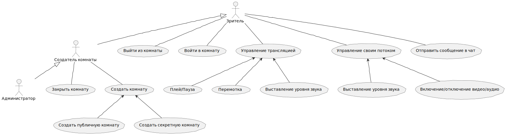

# Кино вместе
Система, позволяющая совместный просмотр видео c 
видео/аудио/текстовым чатом и возможностью управления трансляций каждым участником.
## Требования
### Функциональные
- при создании комнаты сервис генерирует уникальную короткую ссылку; если комната приватная, то
и ключ доступа
- при создании комнаты видео по ссылке скачивается на наш CDN
- должна быть возможность запланировать встречу
- должна быть возможность подключиться к комнате как минимум 5 людям
- к приватной комнате нельзя подключиться не зная пароль
- каждый участник комнаты может управлять общим поток без ограничения (плей/пауза/перемотка/звук)
- каждый участник комнаты может управлять своей трансляцией (включать/отключать звук/видео)
- каждый участник может писать сообщения в чат
- каждый подключающийся в процессе должен иметь доступ к истории чата с самого начала
- вся информация о комнате (включая видео и чат) должна быть доступна минимум три года и максимум
через 3 часа после завершения трансляции
### Нефункциональные
- не должно быть единой точки отказа
### Дополнительные
- возможность собирать аналитику
- автоматическое масштабирование сервиса в зависимости от нагрузки (k8s, облачные решения)
## Оценка ограничений и пропускной способности
Предположим, что у нас одномоментно активно 100 комнат, в каждом комнате в среднем 30 человек и
продолжительность вещания 2 часа.
### Трафик
### Хранилище
### Память
### Пропускная способность
### CPU
## Проектирование API
## Проектирование уровня хранения данных, схема, партицирование
## Схема

## Базовый алгоритм и архитектура

## Масштабирование
## Кэширование
## Диаграмма вариантов использования

## Диаграмма классов
## Диаграмма активностей
## Диаграмма последовательности

## Страницы фронтенда
- Регистрация, вход, выход
- Главная страница с активными публичными комнатами
- страница создания комнаты
- Комната с трансляцией
- 404, 403, 500

## Дополнительная информация
### Альтернативые реализации
- [https://github.com/palavatv/palava](https://github.com/palavatv/palava)
- [https://github.com/edumeet/edumeet](https://github.com/edumeet/edumeet)
- [Jitsi](https://github.com/jitsi/jitsi-videobridge)
- [Janus](https://janus.conf.meetecho.com)
- [Janus Cloud (Python)](https://github.com/OpenSight/janus-cloud)
### Библиотеки
- [aiortc](https://github.com/aiortc/aiortc)
- [pyjanus](https://github.com/skymaze/pyjanus)
### Конференции
[Videotech. Конференция по технологиям видео и стриминга](https://vtconf.com/schedule/)
### Документация
- [mdn](https://developer.mozilla.org/ru/docs/Web/API/WebRTC_API)
- [official](https://webrtc.org)
